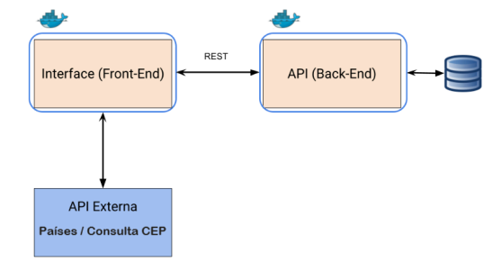

# Cervejaria App Desktop

## Descrição do Projeto
O Cervejaria App é uma aplicação **desktop** desenvolvida com React para gerenciar cervejas. Ela permite que os usuários cadastrem suas cervejas favoritas, visualizem um ranking das cervejas cadastradas e excluam ou editem qualquer item da lista. A interface é simples e intuitiva, com validações nos formulários para garantir que os dados inseridos sejam válidos.


## Funcionalidades:
**Início:** Tela principal com um botão que direciona o usuário para a página de cadastro de novas cervejas.

**Cadastro de Cerveja:** Formulário para o usuário cadastrar uma nova cerveja. A validação inclui campos obrigatórios como nome da cerveja e avaliação. Também valida que o IBU e o preço sejam números válidos e que a avaliação esteja entre 0 e 10.

**Ranking:** Exibe uma lista das cervejas cadastradas, com a possibilidade de excluir uma cerveja da lista através de um botão de lixeira ou adicionar novas cervejas com o botão de "Adicionar Cerveja".

**Fale Conosco:** Exibe um formulário de fale conosco para o usuário enviar uma mensagem. 


## Arquitetura da aplicação

A arquitetura apresentada ilustra a interação entre diferentes componentes da aplicação, oom front-end e back-end containerizados utilizando Docker. A imagem a seguir mostra como esses componentes se conectam:



Descrição do Fluxo:
Interface (Front-End): A interface do usuário se comunica com a API (Back-End) através de chamadas REST.

API (Back-End): A API processa as requisições recebidas da interface e, se necessário, consulta o banco de dados para obter ou armazenar informações.

Integração com APIs externas: A API também é capaz de se comunicar com duas APIs externas para consultar dados como de países e CEPs.

Isolamento dos Componentes: Cada componente — interface e API— está isolado em seu próprio contêiner, o que traz benefícios significativos em termos de gestão e escalabilidade, permitindo um gerenciamento eficiente do sistema, além de ser altamente flexível para evoluções futuras.

## APIs externas:

### 1. **API de Países RestCountries - [https://restcountries.com](https://restcountries.com)**

- **Descrição**: A API RestCountries fornece informações sobre países, como nome, capital, população, moeda, entre outras. Ela é utilizada para buscar e exibir nomes (em português) de países, como parte da funcionalidade de seleção de país na interface.
  
 
- **Rota Utilizada**: 
  - **Endpoint**: `https://restcountries.com/v3.1/all`
  - **Método**: `GET`


### 2. **API de CEP ViaCEP- [https://viacep.com.br](https://viacep.com.br)**

- **Descrição**: A API ViaCEP é utilizada para consultar informações de endereço a partir de um **CEP** (Código de Endereçamento Postal) no Brasil. Ela retorna dados como logradouro, bairro, cidade, estado, entre outros.

- **Rota Utilizada**:
  - **Endpoint**: `https://viacep.com.br/ws/${cep}/json/`
  - **Método**: `GET`
  - **Descrição**: Esta rota retorna as informações do endereço a partir do **CEP** informado. A variável `${cep}` deve ser substituída pelo CEP que você deseja consultar. Exemplo: `https://viacep.com.br/ws/01001000/json/`.


## Como executar o front

**API** As requisições no servidor são simuladas através do arquivo beers.json 

Será necessário ter o [Nodejs, ou o npm,](https://nodejs.org/en/download/) instalado. 

Após clonar o repositório, é necessário ir ao diretório raiz desse projeto pelo terminal para poder executar os comandos descritos abaixo.

```
$ npm install
```

Este comando instala as dependências/bibliotecas, descritas no arquivo `package.json`. Uma pasta chamada `node_modules` será criada.

Para executar a interface basta executar o comando: 

```
$ npm start
```

Abra o [http://localhost:3000/#/](http://localhost:3000/#/) no navegador.


## Como executar através do Docker

Certifique-se de ter o [Docker](https://docs.docker.com/engine/install/) instalado e em execução em sua máquina.

Navegue até o diretório que contém o Dockerfile e o requirements.txt no terminal.
Execute **como administrador** o seguinte comando para construir a imagem Docker:

```
$ docker build -t frond-end .
```

Uma vez criada a imagem, para executar o container basta executar, **como administrador**, seguinte o comando:

```
$ docker run -d -p 80:80 frond-end
```

Uma vez executando, para acessar o front-end, basta abrir o http://localhost:80/#/ no navegador.


### Alguns comandos úteis do Docker

>**Para verificar se a imagem foi criada** você pode executar o seguinte comando:
>
>```
>$ docker images
>```
>
> Caso queira **remover uma imagem**, basta executar o comando:
>```
>$ docker rmi <IMAGE ID>
>```
>Subistituindo o `IMAGE ID` pelo código da imagem
>
>**Para verificar se o container está em exceução** você pode executar o seguinte comando:
>
>```
>$ docker container ls --all
>```
>
> Caso queira **parar um conatiner**, basta executar o comando:
>```
>$ docker stop <CONTAINER ID>
>```
>Subistituindo o `CONTAINER ID` pelo ID do conatiner
>
>
> Caso queira **destruir um conatiner**, basta executar o comando:
>```
>$ docker rm <CONTAINER ID>
>```
>Para mais comandos, veja a [documentação do docker](https://docs.docker.com/engine/reference/run/).